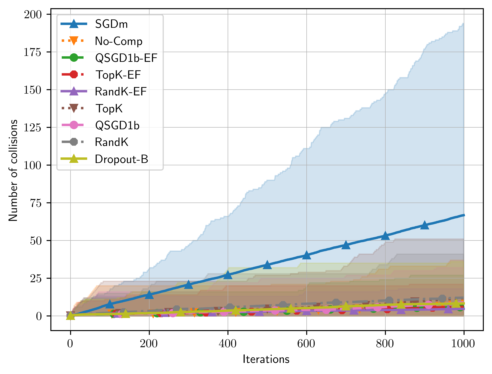
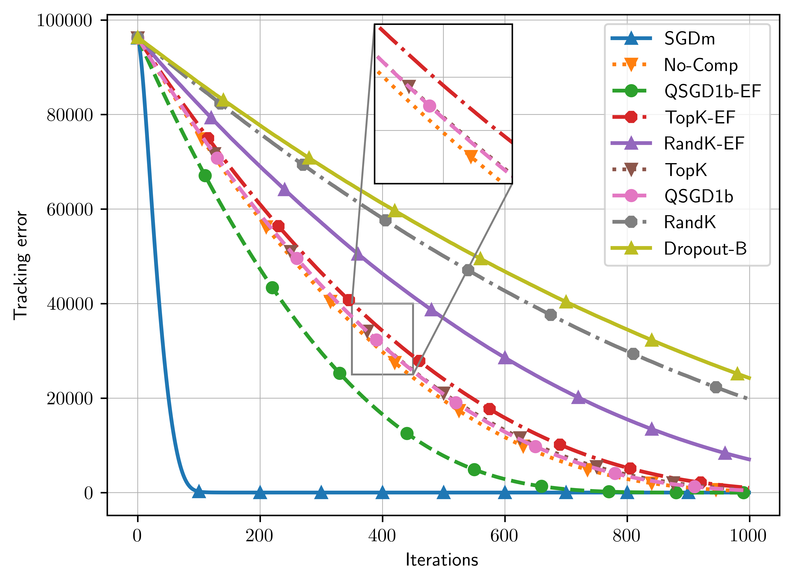
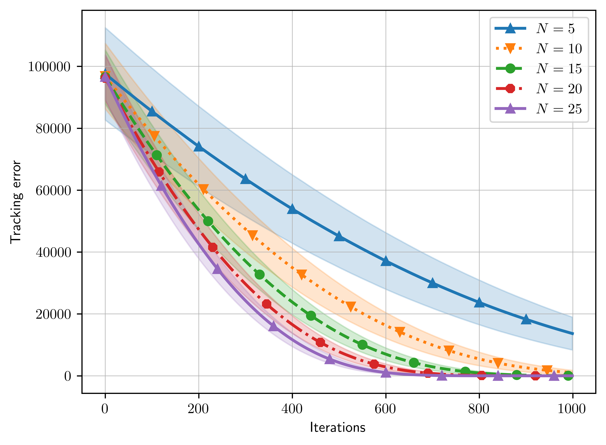
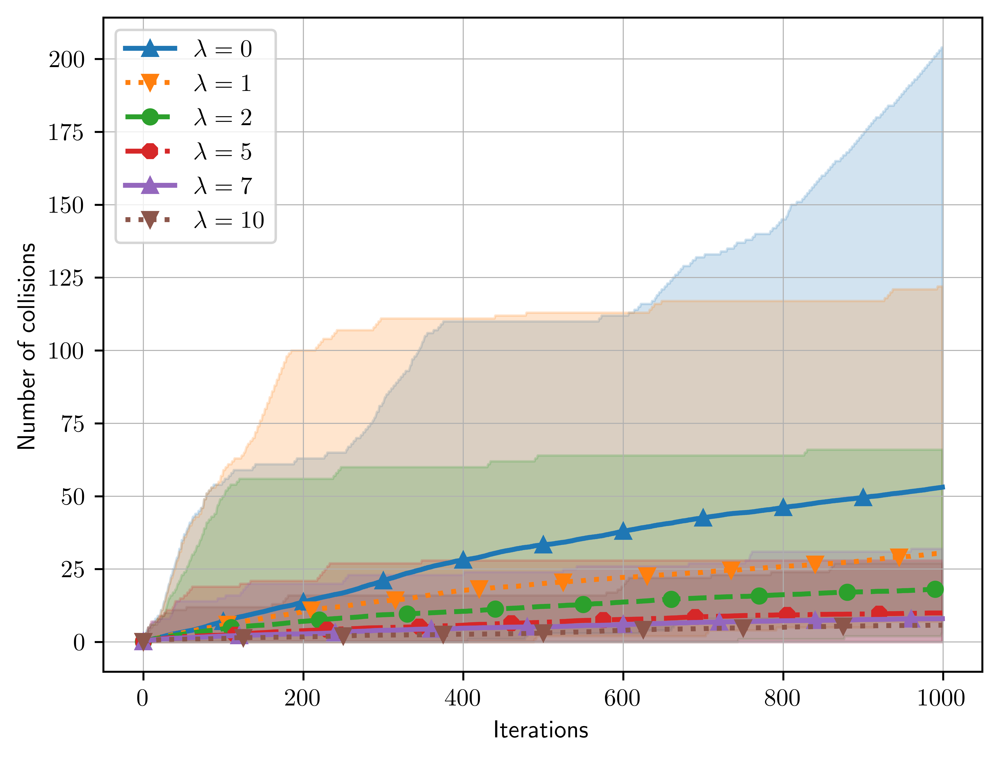

# FED-EF-ZO-SGD
Communication-Efficient Zeroth-Order Distributed Online Optimization: Algorithm, Theory, and Applications

## Abstract 

This paper focuses on a multi-agent zeroth-order online optimization problem in a federated learning setting for target tracking. The agents only sense their current distances to their targets and aim to maintain a minimum safe distance from each other to prevent collisions. The coordination among the agents and dissemination of collision-prevention information is managed by a central server using the federated learning paradigm. The proposed formulation leads to an instance of distributed online nonconvex optimization problem that is solved via a group of communication-constrained agents. To deal with the communication limitations of the agents, an error feedback-based compression scheme is utilized for agent-to-server communication. The proposed algorithm is analyzed theoretically for the general class of distributed online nonconvex optimization problems. We provide non-asymptotic convergence rates that show the dominant term is independent of the characteristics of the compression scheme. Our theoretical results feature a new approach that employs significantly more relaxed assumptions in comparison to standard literature. The performance of the proposed solution is further analyzed numerically in terms of tracking errors and collisions between agents in two relevant applications.







## How do I run the code? 

A. Download our repo.

```
git clone https://github.com/Sunses-hub/FED-EF-ZO-SGD.git
```
B. Go to FED_EF_ZO_SGD directory to run the experiments. 
```
custom_exp.py can be used to run the experiments. 

Parameter Options: 
  parser.add_argument("--compression_name", default="qsgd", help="Compression case without error feedback", type=str)
  parser.add_argument("--compression", default="False", help="Compression case without error feedback", type=str)
  parser.add_argument("--error_feedback", default="False", help="Error-feedback for compressed gradients. ", type=str)
  parser.add_argument("--plot_collisions", default="False", help="Switch for plotting collision vs. time", type=str)

  parser.add_argument("--fraction_cord", default=.5, help="Fraction for top-k compression", type=float)
  parser.add_argument("--eta", default=0.35, help="Learning rate for SGD", type=float)
  parser.add_argument("--Lambda", default=10, help="Regularization term", type=float)
  parser.add_argument("--dropout_p", default=.5, help="Dropout probability p", type=float)
  parser.add_argument("--noise", default=.5, help="Dropout probability for neighbors", type=float)

  parser.add_argument("--num_bits", default=3, help="Number of bits for quantization level in qsgd", type=int)
  parser.add_argument("--N", default=20, help="Number of agents", type=int)
  parser.add_argument("--R", default=10, help="Radius of agent's neighbor", type=int)
  parser.add_argument("--init_size", default=100, help="Initialization size", type=int)
  parser.add_argument("--steps", default=3000, help="Number of steps for SGD", type=int)
  parser.add_argument("--iterations", default=5, help="Number of experiments for each case", type=int)
  parser.add_argument("--animate", default="False", help="Switch on the animation", type=str)
  
 plot_custom_exp.py can be used to plot the experiments that were run and saved to "custom_exp" folder. 
 
 Parameter Options:
  parser.add_argument("--dir", default="custom_exp", help="Directory name for loss histories generated by custom experiments", type=str)
  parser.add_argument("--legends", default ="top rand qsgd tope", help="Legends for the plot you want to display", type=str)
  parser.add_argument("--plot_collisions", default="False", type=str)
  parser.add_argument("--title", default="Loss vs. Time", type=str)
  parser.add_argument("--ylabel", default="Loss", type=str)
  
Note: custom_exp.py script opens "custom_exp" folder and saves the results there. After you stop running sequence of custom experiments, you need to change the name of that folder to something different than "custom_exp".
```

## Experiment 1 

Run the following scripts respectively to reproduce the results of figure 1.a and 1.b. 
```
python3 custom_exp.py --compression False --plot_collisions True 
python3 custom_exp.py --compression True --plot_collisions True --error_feedback True --compression_name qsgd --num_bits 2 
python3 custom_exp.py --compression True --plot_collisions True --compression_name qsgd --num_bits 1 
python3 custom_exp.py --compression True --plot_collisions True --compression_name top
python3 custom_exp.py --compression True --plot_collisions True --compression_name top --error_feedback True 
python3 custom_exp.py --compression True --plot_collisions True --compression_name dropout-biased 
python3 custom_exp.py --compression True --plot_collisions True --compression_name rand 
```

To plot the results of that experiment, run the following script.

For figure 1.a:
```
python3 plot_custom_exp.py --legends "NoComp QSGD2bEF QSGD1b Top TopEF Dropout-Biased Rand" --title "Nonconvex Objective for Different Compressions" --ylabel "Loss"
```
For figure 1.b:
```
python3 plot_custom_exp.py --legends "NoComp QSGD2bEF QSGD1b Top TopEF Dropout-Biased Rand" --title "Nonconvex Objective for Different Compressions" --ylabel "Number of Collisions" --plot_collisions True
```
Warning: After you are done with the results of this experiment, don't forget to change the name of the custom_exp. If you don't do that, new experiments will write into that folder and different experiments will be mixed. 

## Experiment 2 

Run the following scripts respectively to reproduce the results of figure 1.c. 

```
python3 custom_exp.py --compression True --compression_name qsgd --plot_collisions True --num_bits 2 --error_feedback True --N 5 --eta 0.2
python3 custom_exp.py --compression True --compression_name qsgd --plot_collisions True --num_bits 2 --error_feedback True --N 10 --eta 0.283
python3 custom_exp.py --compression True --compression_name qsgd --plot_collisions True --num_bits 2 --error_feedback True --N 15 --eta 0.346
python3 custom_exp.py --compression True --compression_name qsgd --plot_collisions True --num_bits 2 --error_feedback True --N 20 --eta 0.4
python3 custom_exp.py --compression True --compression_name qsgd --plot_collisions True --num_bits 2 --error_feedback True --N 25 --eta 0.447
```

To plot the results, run the followin scripts.

To plot the loss (figure 1.c):
```
python3 plot_custom_exp.py --legends "N=5 N=10 N=15 N=20 N=25" --title "QSGD with EF for Different Number of Agents with Proportional Learning Rates" --ylabel "Loss"
```
You can also plot the collision plot:
```
python3 plot_custom_exp.py --legends "N=5 N=10 N=15 N=20 N=25" --title "QSGD with EF for Different Number of Agents with Proportional Learning Rates" --ylabel "Loss" --plot_collisions True 
```
Warning: After you are done, don't forget to change the name of "custom_exp" folder. 


## Experiment 3 

Run the following scripts respectively to reproduce the results of figure 1.d. 

```
python3 custom_exp.py --compression True --compression_name qsgd --plot_collisions True --error_feedback True --num_bits 2 --Lambda 0 
python3 custom_exp.py --compression True --compression_name qsgd --plot_collisions True --error_feedback True --num_bits 2 --Lambda 1
python3 custom_exp.py --compression True --compression_name qsgd --plot_collisions True --error_feedback True --num_bits 2 --Lambda 2 
python3 custom_exp.py --compression True --compression_name qsgd --plot_collisions True --error_feedback True --num_bits 2 --Lambda 5 
python3 custom_exp.py --compression True --compression_name qsgd --plot_collisions True --error_feedback True --num_bits 2 --Lambda 7 
python3 custom_exp.py --compression True --compression_name qsgd --plot_collisions True --error_feedback True --num_bits 2 --Lambda 10 
```

To plot figure 1.d:
```
python3 plot_custom_exp.py --legends "L=0 L=1 L=2 L=5 L=7 L=10" --title "QSGD with EF for Regularizer Test" --ylabel "Number of Collisions" --plot_collisions True 
```
You can also plot the loss: 
```
python3 plot_custom_exp.py --legends "L=0 L=1 L=2 L=5 L=7 L=10" --title "QSGD with EF for Regularizer Test" --ylabel "Number of Collisions"
```
Warning: After you are done, don't forget to change the name of "custom_exp" folder. 

To see the animation of any experiment, you can just make --animate argument True. 
